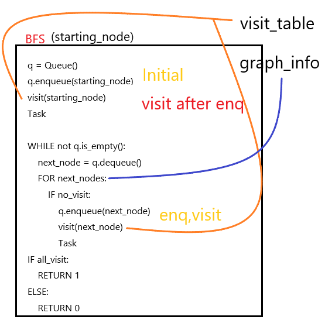

# BFS (Breadth First Search)
drop by adjacent node (in the same level) in order.

## use of Queue

start, at node A

enQueue A
and deQueued node (A) and enQueue adjacent nodes of A

repetitation this procedure.



example
```python
### Stack
class Node:
    def __init__(self, val = None):
        self.val = val
        self.prior = None
        self.next = None

class Queue(Node):
    def __init__(self):
        self.front = Node()
        self.tail = self.front
        self.count = 0

    def enqueue(self, val):
        self.tail.next = Node(val)
        self.tail = self.tail.next
        self.count += 1
        
    def enqueue(self, *args):
        
        for val in args:
            self.tail.next = Node(val)
            self.tail = self.tail.next
            self.count += 1

    def dequeue(self):
        if self.is_empty():
            print("Queue is empty")
        else:
            tmp = self.front.next.val
            if self.front.next is self.tail:
                self.tail = self.front
            else:
                self.front.next = self.front.next.next
            self.count -= 1
            return tmp

    def is_empty(self):
        return self.tail == self.front

    def peek(self):
        return self.front.next.val

    
def BFS(s):
    q = Queue()
    q.enqueue(s)
    print("visit {}th Node".format(s))
    visit_table[s-1] = True
    
    while not q.is_empty():
        next_node = q.dequeue()
        
        for vertex in range(len(graph_table)):
            if graph_table[next_node-1][vertex] and not visit_table[vertex]:
                q.enqueue(vertex+1)  
                print("visit {}th Node".format(vertex+1))
                visit_table[vertex] = True

    if all(visit_table):
        return 1
    else:
        return 0
    
    
if __name__ == '__main__':
    graph_table = [[0,1,1,0,0],[0,0,0,1,0],[0,0,0,0,1],[0,0,0,0,0],[0,0,0,0,0]]
    visit_table = [0]*5
    BFS(1)
    print(visit_table)
```