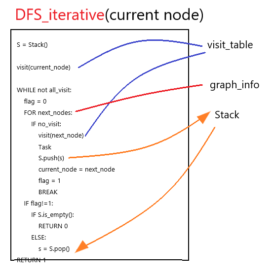

# Depth-first search

## 1. Using Stack
1. From departure point to one way, go until obastacle that means no where to go. 
2. Then, go back to the latest forked road and again from 1

This procedure is good in stack


## 2. DFS Algorithm

1. Decide starting node v, and visit
2. Among adjacent nodes to v. if there exists w, which is not yet visited, push v to the stack and go to w.
3. let w v, go back to pop, and repeat until stack become empty state.




## DFS python sample code
```python
#### DFS
def DFS(S, G, graph_table, visit_table):
    if visit_table[G-1] > 0:
        return 1

    visit_table[S-1] += 1
    v = S
    # stop conditions
    idxes = find_next_node(graph_table[v - 1])  # island node
    if idxes:
        for x in idxes:
            if x + 1 == G:
                return 1
        stack.push(v)  ### original node number in stack idx+1

        for w in idxes:
            if visit_table[w] == 0:
                w += 1
                return DFS(w, G, graph_table, visit_table)
    else:
        if stack.isEmpty():
            return 0
        else:
            vb = stack.pop()
            return DFS(vb, G, graph_table, visit_table)

### Stack
class Node:
    def __init__(self, val):
        self.val = val
        self.prior = None


class Stack(Node):
    def __init__(self):
        self.top = None
        self.count = 0

    def push(self, val):
        tmp = self.top
        self.top = Node(val)
        self.top.prior = tmp
        self.count += 1

    def pop(self):
        if self.top:
            tmp = self.top.val
            self.top = self.top.prior
            self.count -= 1
            return tmp
        else:
            print("Stack is empty")

    def isEmpty(self):
        return self.top == None

    def peek(self):
        return self.top.val

    def clear(self):
        self.top = None


T = int(input())

for case in range(1, T + 1):

    V, E = list(map(int, input().split()))
    graph_table = [[0] * V for _ in range(V)]

    for _ in range(E):
        N, M = list(map(int, input().split()))
        graph_table[N-1][M-1] = 1

    S, G = list(map(int, input().split()))

    visit_table = [0] * V
    stack = Stack()
    result = DFS(S, G, graph_table, visit_table)

    print("#{} {}".format(case, result))

```