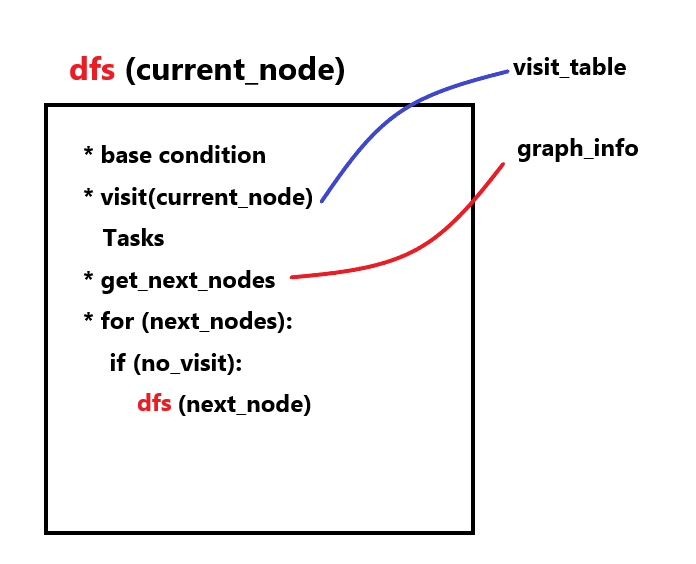

# Depth-first search

## 1. Using Stack
1. From departure point to one way, go until obastacle that means no where to go. 
2. Then, go back to the latest forked road and again from 1

This procedure is good in stack


## 2. DFS Algorithm

1. Decide starting node v, and visit
2. Among adjacent nodes to v. if there exists w, which is not yet visited, push v to the stack and go to w.
3. let w v, go back to pop, and repeat until stack become empty state.

**DFS recursive form for Tree**



## DFS python sample code
```python
## These works in Tree. not graph (known root, no cycle)!!!!!!!
### simplified DFS ## using adjacency table!!!

### iterative way with stack
def dfs_iter(s):
    stack = Stack()
    i = s - 1

    stack.push(i)
    ################
    ## 1st action ##
    ################
    visit_table[i] = True
    print("visit {}th Node".format(s))

    while not all(visit_table):

        for vertex in range(len(graph_table)):
            if graph_table[i][vertex] and not visit_table[vertex]:

                stack.push(vertex)
                ################
                #### action ####
                ################
                visit_table[vertex] = True
                print("visit {}th Node".format(vertex+1))

        if stack.isEmpty():
            break
        else:
            i = stack.pop()

def dfs(s):
    if all(visit_table):
        return

    visit_table[s-1] = True
    print("visit {}th Node".format(s))

    for vertex in range(len(graph_table)):
        if graph_table[s-1][vertex] and not visit_table[vertex]:
            dfs(vertex+1)


def DFS(S):
    if all(visit_table):
        return
    visit_table[S - 1] = True
    print("visit {}th Node".format(S))

    for w in range(len(graph_table)):
        if graph_table[S - 1][w] and not visit_table[w]:
            w += 1  ## index-node calibration
            stack.push(S)  ### original node number in stack idx+1
            return DFS(w)

    if stack.isEmpty():
        return
    else:
        vb = stack.pop()
        return DFS(vb)

if __name__ == '__main__':
    graph_table = [[0,1,1,0,0],[0,0,0,1,0],[0,0,0,0,1],[0,0,0,0,0],[0,0,0,0,0]]
    visit_table = [0]*5
    stack = Stack()

    #DFS(1)
    #dfs(1)
    dfs_iter(1)
    print(visit_table)

### Stack is needed!
### Recursion itself system stack.

### Stack
class Node:
    def __init__(self, val):
        self.val = val
        self.prior = None


class Stack(Node):
    def __init__(self):
        self.top = None
        self.count = 0

    def push(self, val):
        tmp = self.top
        self.top = Node(val)
        self.top.prior = tmp
        self.count += 1

    def pop(self):
        if self.top:
            tmp = self.top.val
            self.top = self.top.prior
            self.count -= 1
            return tmp
        else:
            print("Stack is empty")

    def isEmpty(self):
        return self.top == None

    def peek(self):
        return self.top.val

    def clear(self):
        self.top = None

```