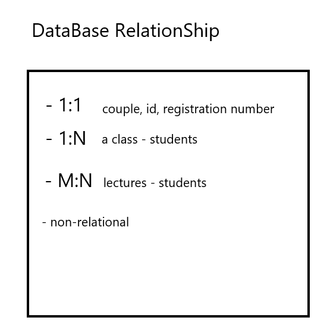

# Django

## I. Framework
Framework is like Opening chain store to concentrate only offering service.

If you do not use framework, do following yourself...
URL parsing
DB setting
ORM
Security
Template
Caching 
Content Management
Web server setting... No way.


Framework makes developer to focus on service!


Kinds of framework
1. Express JS
2. Ruby on Rails
3. Python Django
4. PHP Laravel
5. Java Spring

## II. Why do we use Django?!
[](https://www.hotframeworks.com)


## III. Architecture of Django

1. M: model (manage data)
2. V: View (intermediate manager) (controller between M and T most important)
3. T: Template (on user)


## IV. Construct Environment!

python environment! pyenv.
And, we will use Django v2. !!!

```bash
git clone https://github.com/pyenv/pyenv.git ~/.pyenv
echo 'export PYENV_ROOT="$HOME/.pyenv"' >> ~/.bashrc
echo 'export PATH="$PYENV_ROOT/bin:$PATH"' >> ~/.bashrc
echo -e 'if command -v pyenv 1>/dev/null 2>&1; then\n  eval "$(pyenv init -)"\nfi' >> ~/.bashrc
exec "$SHELL"

git clone https://github.com/pyenv/pyenv-virtualenv.git $(pyenv root)/plugins/pyenv-virtualenv
echo 'eval "$(pyenv virtualenv-init -)"' >> ~/.bashrc
exec "$SHELL"
```

```bash
pyenv install 3.6.7

pyenv global 3.6.7
```

> mkdir PRACTICE
> cd PRACTICE
> pyenv virtualenv 3.6.7 practice-venv
> pyenv local practice-venv
> pip install django
> django-admin startproject test .

at settings.py,
add 'address' to ALLOWED_HOSTS
**remarks** 
1. ommit `https://`
2. ommit `/` at the tail.

**Tip** When use `source .bashrc` in the py virtualenv, `source deactivate`

`python manage.py runserver $IP:$PORT`

**Tip** Sementic Versioning.
* v3.6.7 
3: Breaking - Breaking change, incompatible API changes.
6: Feature - new feature, add backwards-compatible functionality.
7: Fix - bug fix, make backwards-compatible bug fix.

**Tip**: Django Project is a collection of applications.

## V. Views
After `python manage.py startapp <app_name>`
In `INSTALLED_APPS` in settings.py,
add the `<app_name>`. (trailing comma.)

**Tips**: Use of trailing comma in collection is convention in Django.

#### 1. Making basic web from views.py

##### views.py in application directory
```python
from django.shortcuts import render
# function-based
def index(request):
    context = {"msg":"hello","name":"JM"}
    return render(request, 'index.html', context)
```
making directory name of "templates" in the app directory.
And, put html documents in it.
**Router?! url route is in urls.py**

##### urls.py in Django project directory

```python
from django.contrib import admin
from django.urls import path

from <app_name> import views

urlpatterns = [
    path('admin/', admin.site.urls),
    path("", views.index), # root url
    path('url/','function in view'),
]

```

#### 2. Variable Routing
views.py
```python
def cube(request,number):
    d = number**3
    return render(request,'cube.html',{"cubic":d})
```
urls.py
```python
from django.contrib import admin
from django.urls import path
from pages import views

urlpatterns = [
    path('admin/', admin.site.urls),
    path("", views.index),
    path("isval/",views.isval),
    path("cube/<int:number>",veiews.cube),### cube and <int:number> the same as flask
]
```

#### 3. GET
```python
def func(request):
    data = request.GET.get("name")
    return render(request,'target.html',{'data':data})
```

#### 4. POST
```python
def create(request):
    title = request.POST.get("title") ## POST type.
    content = request.POST.get('content')
    
    article = Article(title = title, content = content)
    article.save()
    
    return redirect('/articles')
```

```html
<h2>게시글 작성</h2>
<form action="/articles/create/" method="POST">
    제목: <input type="text" name="title"/>
    내용: <input type="text" name="content"/>
    <input type="submit" value="Submit"/>
     
    <!-- Token Django makes -->
</form>
```

#### 5. url generation by aliasing and naming in urls.py
**Refer the X sub-gatekeeper below**
<a href="#X">go to X</a>

example
`urls.py` at application directory in this below case.
```python
from django.urls import path
from . import views

urlpatterns = [
    path('', views.index, name="index"),
    path('new/',views.new, name="new"),
    path('create/',views.create, name="create"),
    path('<int:article_id>/',views.detail, name="detail"),
    path('<int:article_id>/edit/',views.edit, name="edit"),
    path('<int:article_id>/update/',views.update, name="update"),
    path('<int:article_id>/delete/',views.delete, name="delete"),
]
```

index.html
```html
<h2>게시판 입니다.</h2>
<a href="">새글쓰기</a>
<!--  this url aliasing according to Django template syntax-->

<table>
    <tr>
        <th>Index</th>
        <th>Title</th>
    </tr>
    
    <tr>
        <td>{{ d.id }}</td>
        <td><a href="/articles/{{d.id}}/">{{ d.title }}</a></td>
    </tr>
    
</table>
```
* This url aliasing is also available in views.py python script for redirect(). 
* For these case, use just name.
* If it requires variable routing, just add the variable with comma.

example

```python
def create(request):
    title = request.POST.get("title")
    content = request.POST.get('content')
    
    article = Article(title = title, content = content)
    article.save()
    
    return redirect('detail', article.id)   
```


#### 6. url aliasing with variable routing
example

urls.py at application directory in this below case.
```python
from django.urls import path
from . import views

urlpatterns = [
    path('', views.index, name="index"),
    path('new/',views.new, name="new"),
    path('create/',views.create, name="create"),
    path('<int:article_id>/',views.detail, name="detail"),
    path('<int:article_id>/edit/',views.edit, name="edit"),
    path('<int:article_id>/update/',views.update, name="update"),
    path('<int:article_id>/delete/',views.delete, name="delete"),
]
```

index.html

```html
<h2>게시판 입니다.</h2>
<a href="">새글쓰기</a>


<table>
    <tr>
        <th>Index</th>
        <th>Title</th>
    </tr>
    
    <tr>
        <td>{{ d.id }}</td>
        <td><a href="">{{ d.title }}</a></td>
        <!-- this format just add the variable in order with a space -->
    </tr>
    
</table>

```


## VI. models

#### 1. Django ORM

example
```python
from django.db import models

# Create your models here.
1.
class Article(models.Model):
    title = models.TextField()
    content = models.TextField()
```
1. `python manage.py makemigrations`

2. `python manage.py migrate`


##### runtime CRUD
`python manage.py shell`


example
> from articles.models import Article
> a = Article(title="FAST PIE", content="FAST TF S")
> a.save()

> Article.objects.create(title="FAST PIE2", content="yeah")

* SELECT ALL (in terms of list)
> Article.objects.all()

* SELECT the thing
> Article.objects.filter(title = "FAST PIE").all()
> Article.objects.filter(title = "FAST PIE").first()
> Article.objects.filter(title = "FAST PIE").count()
> Article.objects.get(id=2)
> Article.objects.get(pk=2)
> 

* UPDATE
> a = Article.objects.get(id=3)
> a.content = "anything"
> a.save()


* DELETE
> a = Article.objects.get(id=3)
> a.delete()


* order by
> Article.object.order_by('id')      #  ascending order
> Article.object.order_by('-id')      #  descending order


**Tip** representation conversion at the shell
Define method of __repr__ at class, models.py

#### 2. Fields

1. AutoField
2. BooleanField
3. CharField
4. TextField
5. DateField
6. FileField
7. FloatField
8. ImageField
9. IntegerField
......


[field_and_its_option](https://docs.djangoproject.com/en/2.1/ref/models/fields/)


#### 3.


## VII. admin
at admin.py

example
```python
from django.contrib import admin
from .models import Student

# Register your models here.

admin.site.register(Student)
```
#### 1. display setting in admin page
example

```python
from django.contrib import admin
from .models import Student

# Register your models here.

class StudentAdmin(admin.ModelAdmin):
    list_display = ('name', 'age')


admin.site.register(Student, StudentAdmin)
```


## VIII. files, which are like css, js, and, img, importing in c9
According to Django template Grammer!


1. make `static` directory on the app directory (static: default)
You can check this in settings.py

2. `load static` within django template grammer like jinja `curly-brace with percent` on the top of the html.

3. `static "filepath"` within `curly-brace with percent` in href, etc.


example

```html


<link rel=stylesheet href="">

<!-- laod static cannot be included by inheritance?! -->
```


## IX. with ipython & django_extensions

After generating project and app, add `django_extensions` to the INSTALLED_APPS
at settings.py

## X. sub gate-keeper
<a id="X"></a>
1. generate urls.py in app. This is not the one in project directory

exmaple
urls.py in project
```python
from django.contrib import admin
from django.urls import path, include
from articles import views

urlpatterns = [
    path('admin/', admin.site.urls),
    path('articles/', include('articles.urls')),
    path('', views.index),
]
```
urls.py in app
```python
from django.urls import path
from . import views

urlpatterns = [
    path('', views.index),
    path('new/',views.new),
    path('create/',views.create)
    
]
```

## XI. Super neutral templates

just make directory of templates just under project directory where settings.py is (This is a common convention!)
this has first priority.

Then,
Add the information into the `'DIRS'` of `TEMPLATES` in `settings.py`

```python
TEMPLATES = [
    {
        'BACKEND': 'django.template.backends.django.DjangoTemplates',
        'DIRS': [os.path.join(BASE_DIR, 'board','templates'),], 
        ### Add the line into the DIRS
        'APP_DIRS': True,
        'OPTIONS': {
            'context_processors': [
                'django.template.context_processors.debug',
                'django.template.context_processors.request',
                'django.contrib.auth.context_processors.auth',
                'django.contrib.messages.context_processors.messages',
            ],
        },
    },
]

```


## XII. Database relationship & Foreign Key

* 1:1
* 1:N
* M:N


Foreign Key: Primary Key in another table!

models.py
```python
from django.db import models

# Create your models here.
class Article(models.Model):
    title = models.TextField()
    content = models.TextField()
    
    def __repr__(self):
        return f"<{self.id}: {self.title}-{self.content}>"
        
    def __str__(self):
        return self.__repr__()
        
    
        

class Comment(models.Model):
    content = models.TextField()
    article = models.ForeignKey(Article, on_delete=models.CASCADE, related_name="comments")
    # DO_NOTHING, etc...
    # related_name is for 1 to N getting objects.
```

Query in shell_plus in this case.
# N -> 1
> a = Article.objects.get(pk=2)
> Comment.objects.filter(article=a)

# 1 -> N
> Comment.objects.filter(article_id = {id in Article}).all()
or
> Article.objects.get(pk={id in Article}).comments.all() 

**Remarks**: If you want to use .comments.all() in the html document by django template syntax,
you must ommit () parenthesis


## XX. Commands

1. `python manage.py runserver $IP`
* At C9: `python manage.py runserver $IP:$PORT`

2. `python manage.py startapp <app_name>`
generate needed directory and files.
(view.py, models.py, admin.py, etc)


3. `python manage.py makemigrations`

4. `python manage.py migrate`

5. `python manage.py shell`

6. `python manage.py sqlmigrate articles 0001`

7. `python manage.py createsuperuser`

8. `python manage.py dbshell`

9. `python manage.py shell_plus`


##### TIP Standard CRUD

**R**
/app_name/            list page
/app_name/1           `detail`
**C**
/app_name/new         `new`
/app_name/create      `create`
**U**
/app_name/1/edit      `edit`
/app_name/1/update    `update`
**D**
/app_name/1/delete    `delete`

This is not actually fit to RESTful definitely

* refer `RESTful API`
